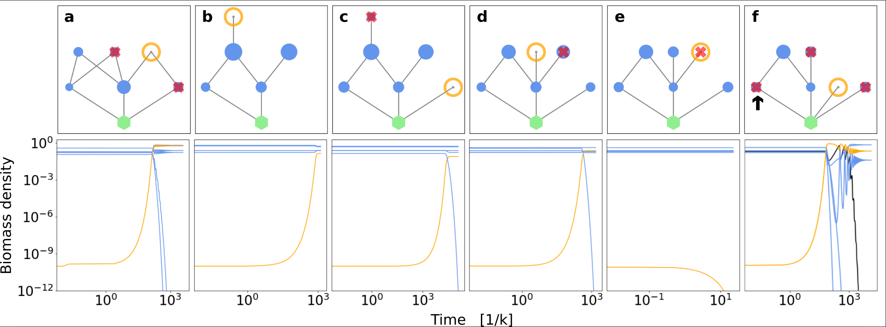

# FoodWebs

This repository contains C++ code for generating simulation data on the evolution of ecological networks using generalized Lotka–Volterra dynamics.
The data is used [here](https://doi.org/10.1038/s41598-022-17379-6).



---

## Repository structure

- `src/`  
  Core C++ source files:
  - `main.cpp` – Main simulation with Holling type I interactions.
  - `main_typeII.cpp` – Supplementary simulation with Holling type II interactions.
  - `food_web.cpp`, `food_web.h` – Functions for constructing and manipulating food webs.
  - `parameters.cpp`, `parameters.h` – Definitions of ecological and numerical parameters.
  - `species.cpp`, `species.h` – Species class definitions.
  - `time_series.cpp`, `time_series.h` – Handling of time-series data for simulations.
  - `time_series_typeII.cpp` – Time-series routines for Holling type II simulations.
  - `random_matrix.cpp` – Generation and eigenvalue computation of random matrices.
  - `stability_analysis.cpp`, `stability_analysis.h` – Routines for stability-related calculations.

- `data/`  
  Directories for storing simulation outputs:
  - `new_data/` – Default simulation output folder.
  - `treelike/` – Consumers are allowed only a single resource, resulting in treelike food-web structures.
  - `non_omnivorous/` – Consumers are allowed one or two resources from the same trophic level.
  - `omnivorous/` – Consumers are allowed one or two resources from any trophic level.  
  - `vec/` – As in `omnivorous/`, but also saving eigenvectors of the community matrix.
  - `random_matrix/` – Eigenvalues from random matrices.

- `exe/`: Compiled executables.

---

## Model overview

Food webs are modelled using generalized Lotka–Volterra equations:

- New species are introduced sequentially as invasive species.
- After each invasion, the system is simulated toward a steady state.
- If no stable, feasible equilibrium exists, species are allowed to go extinct until a stable, feasible equilibrium is obtained.
- If the system neither reaches a steady state nor experiences any extinctions within `t_max`, the biomasses are set to their fixed-point values and the simulation is continued. This situation is very rare.


Two interaction types are implemented:

- Holling type I (`main.cpp`)
- Holling type II (`main_typeII.cpp`)

---

## Parameters and configuration

- Most parameters are defined in `src/parameters.h` (and implemented in `parameters.cpp`).
- The upper limit on species richness and species-specific settings are in `src/species.h`.
- The total number of invasion attempts and some run-specific options are set in:
  - `src/main.cpp`
  - `src/main_typeII.cpp`

---

## Dependencies

This project uses [Eigen](https://eigen.tuxfamily.org/index.php?title=Main_Page 'Eigen') for matrix operations.

---

## Compilation and usage

From the repository root:

```bash
cd src

# Example compilation commands
g++ -O3 -std=c++11 -I /path/to/eigen main.cpp          -o ../exe/foodweb_typeI
g++ -O3 -std=c++11 -I /path/to/eigen main_typeII.cpp   -o ../exe/foodweb_typeII
g++ -O3 -std=c++11 -I /path/to/eigen random_matrix.cpp -o ../exe/random_matrix
